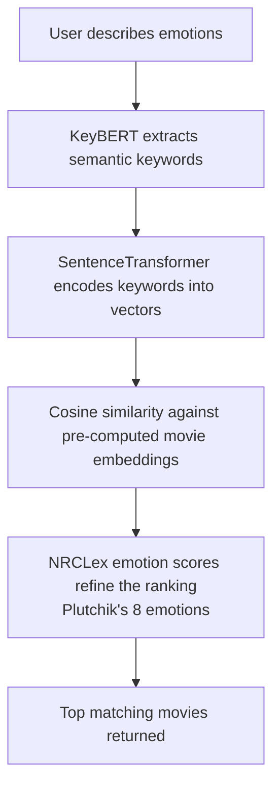
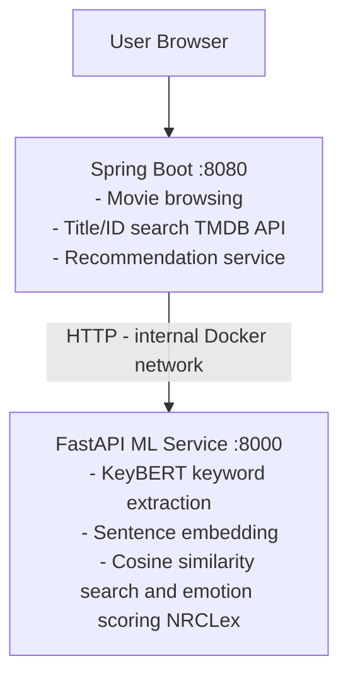

# 🎬 MoodReel

> Find movies based on the emotions you want to feel.

MoodReel is a movie recommendation system that goes beyond genres and ratings. Instead of searching by title, you describe the emotional experience you're looking for — and the system finds films that match your mood using semantic AI and emotion analysis.

This project is still under improvement.

---

## Features

- **Emotion-based search** — describe how you want to feel, get matched movies
- **Browse current & upcoming releases** — stay up to date with what's in theaters
- **Search by title or ID** — classic search powered by the TMDB API

---

## How It Works



The ML pipeline runs as a separate FastAPI microservice, keeping the Spring Boot backend clean and the two services independently scalable.

---

## Tech Stack

| Layer | Technology |
|---|---|
| Backend | Java · Spring Boot |
| Frontend | Thymeleaf |
| ML Service | Python · FastAPI |
| Dataset | TMDB 5000 Movies (via HuggingFace) |
| Keyword Extraction | KeyBERT |
| Semantic Embeddings | SentenceTransformers (`all-MiniLM-L6-v2`) |
| Emotion Analysis | NRCLex (Plutchik's 8 emotions) |
| Data Source | TMDB API |
| Infrastructure | Docker · Docker Compose |

---

## Architecture



---

## Getting Started

### Prerequisites

- Docker & Docker Compose
- A TMDB API key → [themoviedb.org](https://www.themoviedb.org/settings/api) (to be added into .env file)
- The pre-trained model files (see below)

### Setup

**1. Clone the repo**

Open a terminal and run the following commands:
```
git clone https://github.com/Vhyra/MoodReel.git
cd MoodReel
```

**2. Add the model**

This step downloads the model, pre-computes movie embeddings and creates the movies_indexed.csv file used to match the keywords and feeling with movies.

Run it once before the first launch:
```
cd preprocessor
pip install -r requirements.txt
python prepare.py
python builder.py
```

**3. Configure environment variables**

From root directory MoodReel:
```
cp .env.example .env
# Edit .env and fill in your values
```

**4. Build and Run**

```
docker compose build (it builds the docker's images)
docker compose up (to run the containers)
```

App will be available at `http://<your-machine-ip>:8080`
To find your machine IP: `ipconfig` on Windows, `ifconfig` or `ip a` on Linux/Mac.
Any device on the same local network can access the app at that address.

To stop the containers, open a second terminal in the root directory MoodReel and run the following command:
```
docker compose down
```

---

## Environment Variables

```env
# .env.example
TMDB_API_KEY=
TMDB_BASE_URL=
```

---

## Project Structure

```
MoodReel/
├── moviefetcher/          # Spring Boot application
│   └── Dockerfile
├── movieml/               # FastAPI ML microservice
│   ├── Dockerfile
│   └── model/             # Model files (not included in repo)
│       └── sentence_transformer/
├── docker-compose.yml
├── .env.example
└── .gitignore
```

---

## Challenges & Learnings

- Balancing semantic similarity and emotion scoring
- Managing two language runtimes (Java + Python) in Docker
- Learning Spring Boot: first project built with Spring Boot, covering REST controllers, Thymeleaf templating, and external API integration
- Preprocessing pipeline to clean data

---

## License

This project is licensed under the MIT License.

The `all-MiniLM-L6-v2` model is distributed under the Apache 2.0 License by the sentence-transformers team.